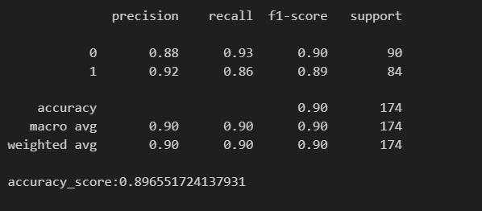
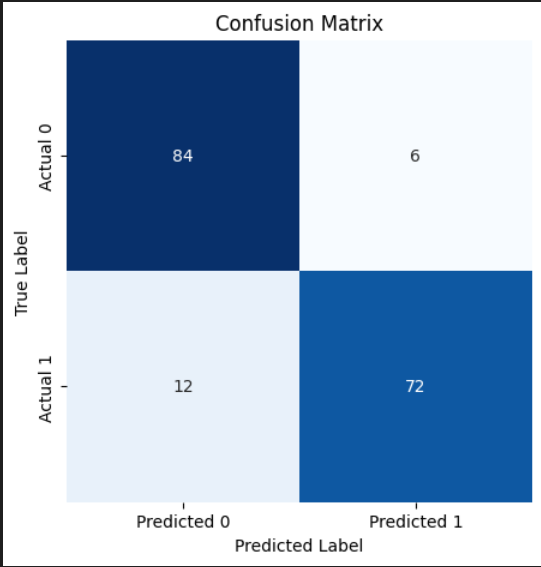

# Sentiment Analyze API
 
### Apiyi Çalıştırmak için yapmaznız gerekenler 

Öncelikle models.txt dosyası içerisinde bulunan linkten modeli indirmelisiniz.
İndirilen model model klasorünün içine koyulmalıdır.

Link: https://drive.google.com/file/d/1E8-v-P1vhrQhxsEKjHpP4_P0uSWplU_L/view?usp=sharing

Daha Sonra virtual environment oluşturup gerekli kütüphaneleri kurmalısınız.

    pip install -r requirements.txt

    python app.py
### API'yi dockerize etme
Build alma 

    docker build -t sentiment_analyze_api .

sonrasında aşağıdaki komut ile image'ı kontrol edebilirsiniz
    
    docker images

Şimdi docker image'ını run edelim ve container'ı çalıştıralım. 

    docker run -d --restart always -p 8080:8080 sentiment_analyze_api

api kullanıma hazır 

## API'nin Başarısı Hakkında:

Gönderilen veri için oluşturulan modelin başarısı aşağıda gösterilmiştir.

NOT: Gönderilen veri tam olarak yeterli bir veri olmadığı için sonuçlar böyledir. Modelin doğruluğunu artırmak için daha fazla ve çeşitli veri toplanması gerekmektedir.

- Classifiacation Report

    

- Confusion Matrix

    